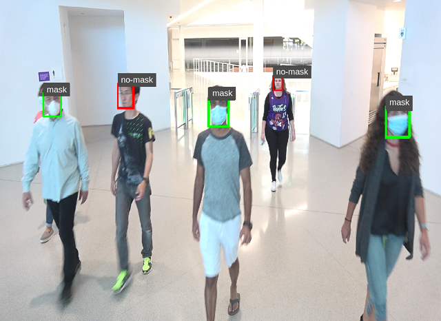
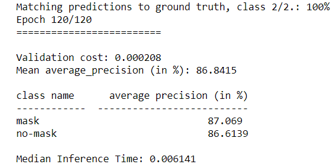
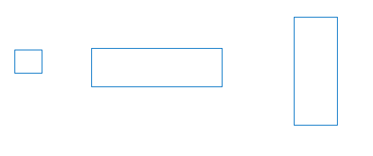
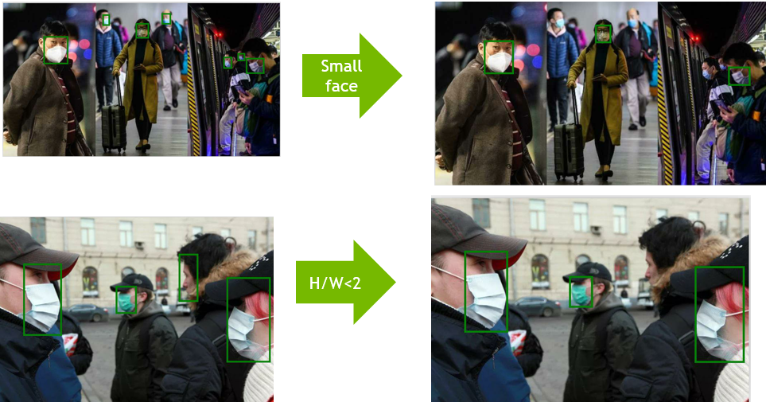
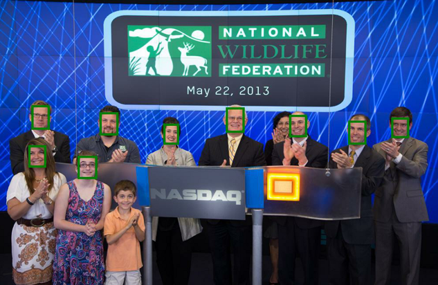

# face_mask_detection

[NVIDIA Developer Blog](https://developer.nvidia.com/blog/implementing-a-real-time-ai-based-face-mask-detector-application-for-covid-19/)

This project just followed the NVIDIA face mask detection github list in reference.

In this git code fixed the issues mAP is too low in origin code, after code refactor mAP can be improved to 86%(mask:87.069%, no-mask:86.6139%)

### Dataset clean rules of orginal git code
- WIDER =>Faces in one picture<4
- Mafa:occulution_degree>2,  mask/no-mask<6000
- Kmmd:None
- Fddb:None

*This clean rules are too simple for mask dataset training.
Since too small faces or too slim faces are not fitted for training in face mask detect scenario, we should clean these kind of samples*

### New dataset clean rules
- small face(40*40)
- w/h ratio abnormal(w/h < 2, h/w>2)

### Clean result
- abnormal face eliminated

- keeped more valid WIDER faces

## Steps to perform

- Clone this github code
- Follow the original github guide to create train dataset:
- Perform training steps with original steps

## Notice
- No more evalutaion on test dasetset
- No more delopyment test on Jetson

Enjoy the code, any issues LET ME KNOW

### References
- https://github.com/NVIDIA-AI-IOT/face-mask-detection
